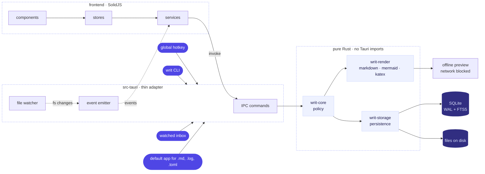
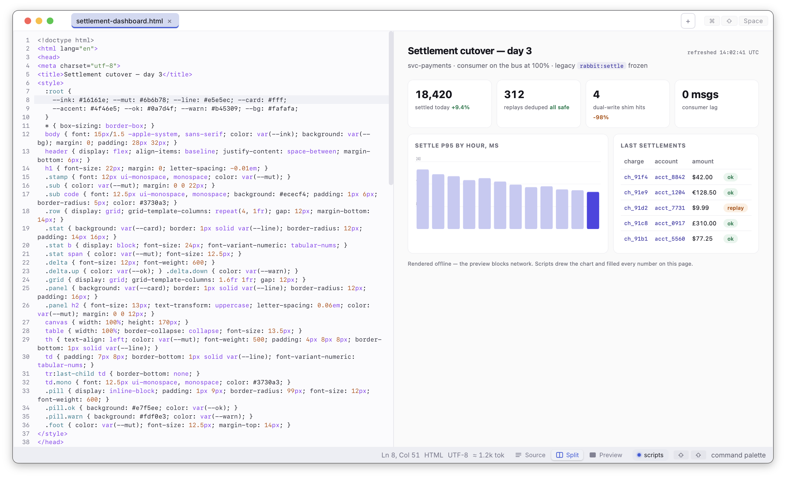
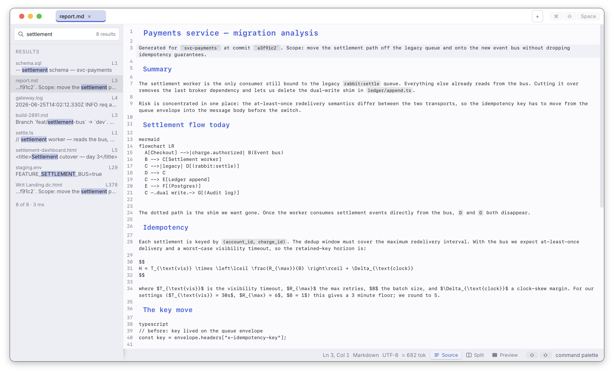
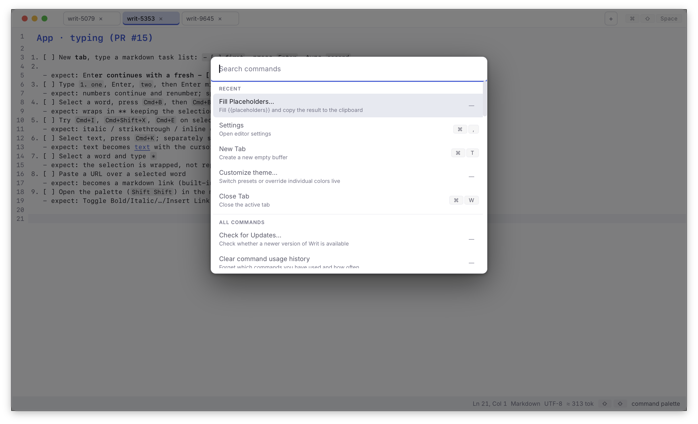

<div align="center">


# Writ

A lightweight, always-ready text editor for developers.

[](https://github.com/ibrahemid/writ/actions)
[](https://github.com/ibrahemid/writ/releases/latest)
[](LICENSE)
[](https://github.com/ibrahemid/writ/releases/latest)
[](https://github.com/ibrahemid/writ/releases)

[**Download**](https://github.com/ibrahemid/writ/releases/latest) · [**Website**](https://writ.ibrahemid.com) · [**Build from source**](#build-from-source)

</div>

<picture>
  <source media="(prefers-color-scheme: dark)" srcset="docs/media/hero-dark.gif">
  
</picture>

## Why I built this

Most of what I open in a day is not code. It is prompts, specs, plans, agent output, knowledge files, the occasional config. Markdown everywhere, half of it written by a machine, and all of it needs a quick look or a quick edit before I move on.

Nothing I tried fits. Notepad++ is not my taste. Sublime is fast, but closing a pile of scratch tabs means a save dialog for every one of them. VS Code drags an IDE's worth of noise into a single markdown file. Obsidian is for people whose life is in their vault. Typora got one thing right: it treats a document the way a browser treats a page. You open it to read it, not to manage it.

Writ extends that to how I work: resident and summoned, not launched. One hotkey and the window is there, holding everything I dumped into it before. Buffers persist on their own, search reaches all of them, and files render in place, offline. Read, change, dismiss.

## Features

- Global hotkey summons the window from anywhere: `Cmd+Shift+Space` on macOS, `Ctrl+Shift+Space` on Windows and Linux
- Autosave on every keystroke; buffers persist across restarts; crash recovery restores the last session
- Full-text search across every buffer, backed by SQLite FTS5
- Split-pane live preview: Markdown, HTML, Mermaid diagrams, and KaTeX math, rendered fully offline with scroll sync
- Command palette on double-tap `Shift`; settings and every command are searchable from it
- CodeMirror 6 editor with language auto-detection, live Markdown typography, and formatting shortcuts
- Prompt fill: placeholder variables, a live token estimate, copy as prompt
- Text transforms such as Tidy Whitespace, built from small composable passes
- Workspace folders with a file tree, plus a watched inbox that opens new files as they arrive
- `writ` CLI for opening files from the terminal; register Writ as the default app for text, config, and source files on macOS
- Browser-style tabs with reopen-closed, light and dark themes, editor and preview font zoom
- Local-only storage, no account, no telemetry; self-updates verify a signed manifest and can be turned off

## Design decisions

Each of these is recorded in [docs/adr/](docs/adr/); the short version:

- **Buffers live in SQLite, not loose files.** That is what makes autosave-per-keystroke, restart persistence, and instant full-text search possible. Files on disk still open and save normally; the database is the scratch layer where most text starts and much of it ends.
- **Resident, not launched.** The app starts hidden and keeps running in the background, so the hotkey shows a window instead of booting a program. Cold start time stops mattering because it happens once.
- **Keyboard first.** Every command, setting, and buffer is reachable from the palette. The mouse is optional.
- **The preview trusts nothing.** Markdown, HTML, Mermaid, and KaTeX render from runtimes bundled into the app, and the preview blocks all network access.
- **The core does not know Tauri exists.** `writ-core`, `writ-storage`, `writ-render`, and `writ-plugin` are plain Rust crates with no Tauri dependency; the shell is a thin adapter. The boundary is enforced by the build, not by convention.
- **Built to catch what other tools produce.** The CLI, the watched inbox, and default-app registration all serve the same case: something else made a file, and Writ is where it opens, rendered and searchable.



## See it in action

<table>
  <tr>
    <td></td>
    <td></td>
    <td></td>
  </tr>
</table>

The [landing page](https://writ.ibrahemid.com) has a live editor you can try in the browser.

## Keyboard shortcuts

| Action | Shortcut |
|---|---|
| Toggle window | `Cmd+Shift+Space` |
| New tab | `Cmd+T` |
| Close tab | `Cmd+W` |
| Switch tabs | `Cmd+[` / `Cmd+]` |
| Reopen closed tab | `Cmd+Shift+T` |
| Command palette | `Shift+Shift` |
| Toggle sidebar | `Cmd+S` |
| Rename tab | Double-click tab |
| Find in document | `Cmd+F` |

Buffers are stored in a local SQLite database under your OS's standard application data directory.

## Install

```sh
brew install --cask ibrahemid/writ/writ                              # macOS
winget install -e --id ibrahemid.Writ                                # Windows
curl -fsSL https://github.com/ibrahemid/writ/raw/main/install.sh | sh # Linux
```

Or grab a `.pkg`, `.dmg`, `.msi`, `.AppImage`, or `.deb` from [Releases](https://github.com/ibrahemid/writ/releases/latest).

## Build from source

Prerequisites: Rust 1.77+, Node.js 20+, pnpm 9+, and the [Tauri v2 platform prerequisites](https://tauri.app/start/prerequisites/) for your OS.

```bash
git clone https://github.com/ibrahemid/writ.git
cd writ
pnpm install
cargo tauri dev
```

For a release build:

```bash
cargo tauri build
```

The installer or app bundle is written to `src-tauri/target/release/bundle/`.

## Tech stack

| Layer | Technology |
|---|---|
| Desktop shell | Tauri v2 |
| Frontend | SolidJS + Vite |
| Editor | CodeMirror 6 |
| Storage | SQLite (WAL mode, FTS5) |
| Core logic | Rust: `writ-core`, `writ-storage`, `writ-render`, `writ-plugin` |

See [docs/ARCHITECTURE.md](docs/ARCHITECTURE.md) for the full system design and [docs/adr/](docs/adr/) for architecture decision records.

## Contributing

Contributions welcome. See [CONTRIBUTING.md](CONTRIBUTING.md) for the development workflow, coding conventions, and pull request process. Security issues go through [SECURITY.md](SECURITY.md).

## License

MIT. See [LICENSE](LICENSE).
