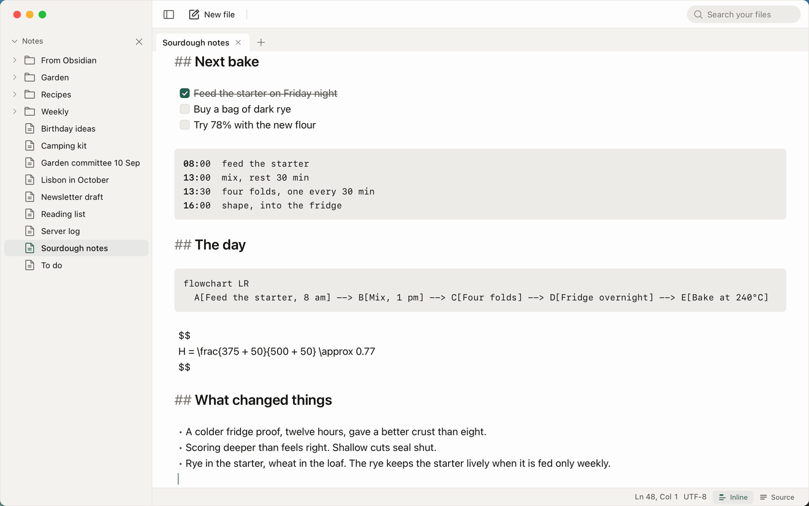
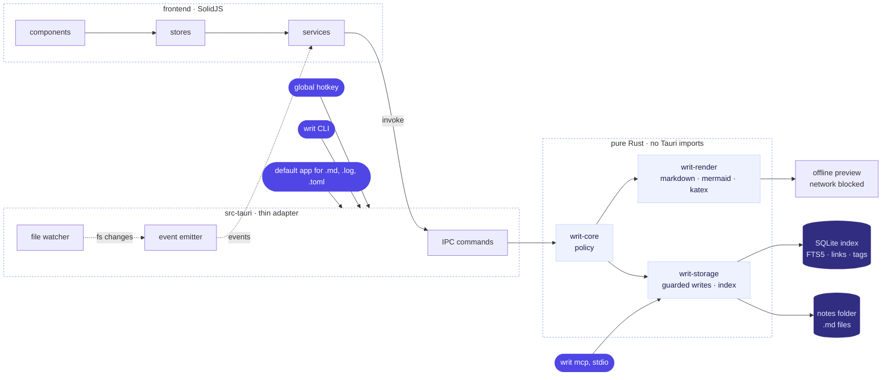
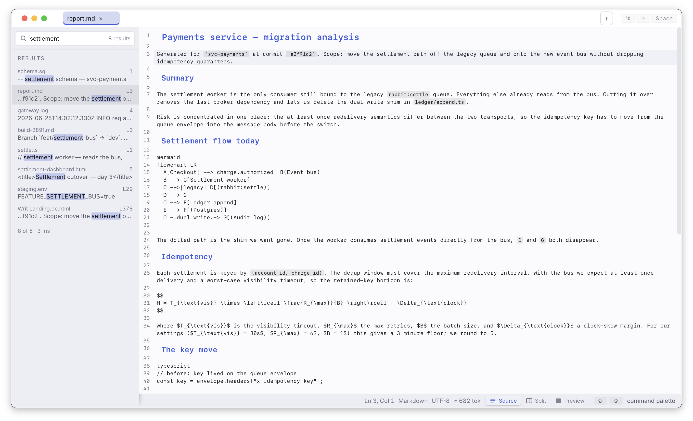
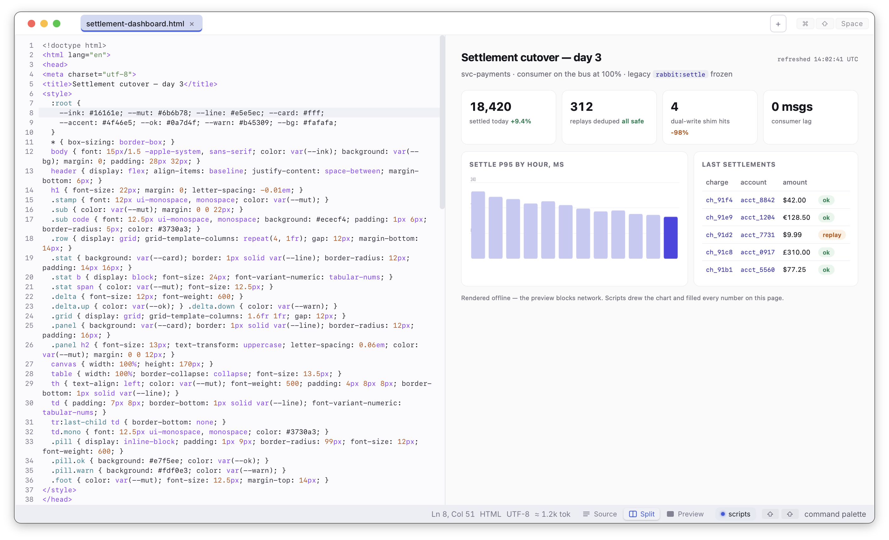
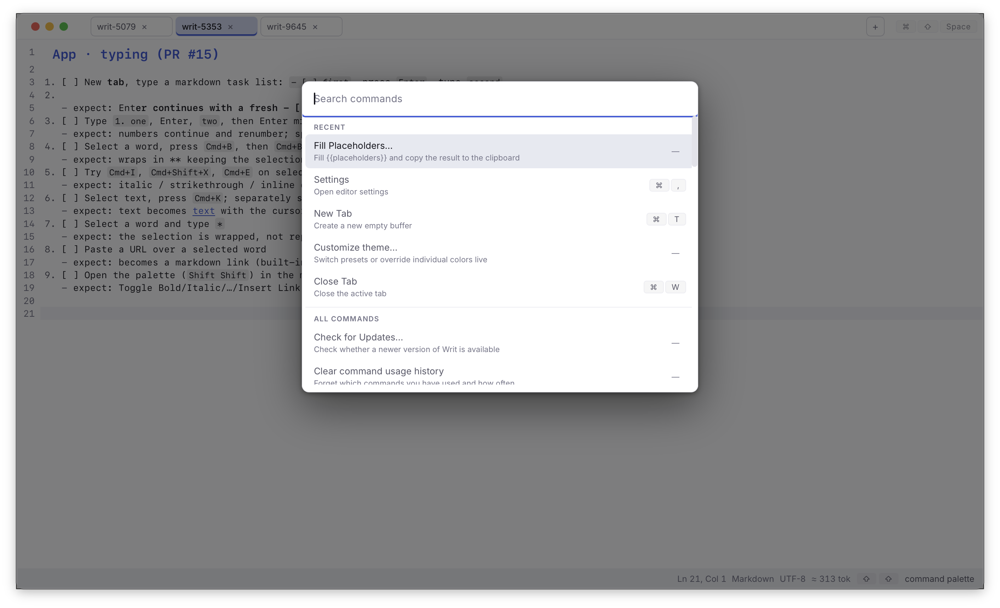

<div align="center">


# Writ

Notes as plain Markdown files in a folder you can open in Finder. Writ links them, searches them and shows what connects them, and nothing leaves the machine.

[](https://github.com/ibrahemid/writ/actions)
[](https://github.com/ibrahemid/writ/releases/latest)
[](LICENSE)
[](https://github.com/ibrahemid/writ/releases/latest)
[](https://github.com/ibrahemid/writ/releases)

[**Download**](https://github.com/ibrahemid/writ/releases/latest) · [**Website**](https://writ.ibrahemid.com) · [**Build from source**](#build-from-source)

</div>

<picture>
  <source media="(prefers-color-scheme: dark)" srcset="docs/media/hero-dark.gif">
  
</picture>

**How it's built.** The architecture was decided by hand and the reasoning is on record: 39 decision records in [docs/adr/](docs/adr/), crate and layer boundaries enforced by the build, and the commit history behind both.
AI assistance was used to write code inside those decisions, not to make them.

## Why I built this

I keep notes as Markdown files because files outlive apps. The apps that work that way tend to ask for a system first: plugins to pick, a folder scheme to commit to, a graph that means little until it has been configured. The apps that ask nothing keep the text somewhere you cannot see.

I wanted the folder of files with the ease of a notes app. Open it, write, and let the app work out what connects to what. Writ is that. The folder is the only copy of your notes. Links, backlinks, tags and the graph are read from the files, so anything else that edits the folder is fine, and deleting Writ's database loses nothing. One hotkey brings the window back with the note you left.

## Features

- Notes are `.md` files in `~/Writ`, or any folder you pick. Renaming a note renames the file; deleting one moves it to the Trash. Nothing is copied or converted.
- `[[Name]]` links a note by name. The Connections panel beside the note lists the notes that link back, the outline and the properties.
- Tags in the sidebar, a graph of the notes around the open one, and a Graph view of the whole folder.
- Live preview for Markdown with callouts, embedded notes, tables, Mermaid diagrams and math, rendered offline. HTML files render in place.
- A change made outside Writ shows up at once. A note with unsaved edits asks before anything is replaced, and a save never overwrites a newer file.
- A folder written in Obsidian opens as it is: [what carries over and what does not](docs/importing-from-obsidian.md).
- Global hotkey summons the window from anywhere: `Cmd+Shift+Space` on macOS, `Ctrl+Shift+Space` on Windows and Linux. The app stays resident.
- Search everywhere on `Cmd+Shift+F`: every note by name and content, plus the contents of any folder you open.
- Command palette on double-tap `Shift`, reaching every command, setting and note.
- Light by default, with six accents and dark presets. Interface text size is one setting.
- Runs without an account and sends no telemetry.

Spell check, selection rewrites, prompt fill, text transforms, link handling and the rest are in [docs/FEATURES.md](docs/FEATURES.md).

## Other programs and AI

Writ ships an MCP server. A client starts it with `writ mcp` over stdio; there is no port. It is off until you turn it on in Settings, and each client is approved by name, with read and write as separate permissions. Every call is listed in the Activity panel with the client, the tool, the note and the decision, never the note's text. A write that would overwrite a newer file is refused when the client passes the hash it read.

The chat pane talks to a local model or a hosted one with your own key, off by default. Only the notes you attach are sent, and Writ names the host and the size before the first send. Edits from the model arrive as proposals you apply or discard.

Nothing leaves the machine unless the client you chose sends it. Writ itself makes two kinds of request: to the AI host you configured, and the update check, which can be turned off. [ADR-031](docs/adr/031-the-ai-harness-and-what-leaves-the-machine.md) is the record; [docs/threat-model.md](docs/threat-model.md) is the checklist it is held to.

## Design decisions

Each of these is recorded in [docs/adr/](docs/adr/); the short version:

- **Files are the only copy of your notes.** Each note is a `.md` file in the notes folder. `writ.db` holds what Writ works out from the files: the search index, links, tags, properties and window state. Delete it and Writ rebuilds it; no note is lost. A file opened from anywhere else saves back to its own path.
- **Resident, not launched.** The app starts hidden and keeps running in the background, so the hotkey shows a window instead of booting a program. Cold start time stops mattering because it happens once.
- **Keyboard first.** Every command, setting and note is reachable from the palette. The mouse is optional.
- **The preview trusts nothing.** Markdown, HTML, Mermaid and KaTeX render from runtimes bundled into the app, and the preview blocks all network access.
- **The core does not know Tauri exists.** `writ-core`, `writ-storage`, `writ-render`, `writ-mcp` and `writ-plugin` are plain Rust crates with no Tauri dependency; the shell is a thin adapter. The boundary is enforced by the build, not by convention.
- **One guarded write.** The editor, the `writ` command, a rename, a link rewrite, a connected program and a chat proposal all write a note through the same path, which refuses to overwrite a newer file and leaves a conflict copy beside the note.
- **Other programs are welcome, by name.** The CLI, the watched folder, default-app registration and the MCP server all exist so that something else can make or read a file and Writ is where it opens, rendered and searchable.


```mermaid
flowchart LR
    classDef entry fill:#4f46e5,color:#fff,stroke:none
    classDef data fill:#312e81,color:#e0e7ff,stroke:none
    classDef crate fill:#eef2ff,color:#1e1b4b,stroke:#c7d2fe
    classDef zone fill:none,stroke:#818cf8,stroke-dasharray:3 3

    HK([global hotkey]):::entry
    CLI([writ CLI]):::entry
    MCP([writ mcp, stdio]):::entry
    ASSOC([default app for .md, .log, .toml]):::entry

    subgraph FRONT [frontend · SolidJS]
        direction LR
        UI[components] --> ST[stores] --> SV[services]
    end

    subgraph SHELL [src-tauri · thin adapter]
        direction LR
        CMD[IPC commands]
        EVT[event emitter]
        FSW[file watcher]
    end

    subgraph CORE [pure Rust · no Tauri imports]
        direction LR
        WC[writ-core<br>policy]:::crate
        WR[writ-render<br>markdown · mermaid · katex]:::crate
        WS[writ-storage<br>guarded writes · index]:::crate
    end

    HK & CLI & ASSOC --> SHELL
    MCP --> WS
    SV -- invoke --> CMD
    EVT -. events .-> SV
    FSW -. fs changes .-> EVT
    CMD --> WC
    WC --> WR --> PV[offline preview<br>network blocked]
    WC --> WS
    WS --> DB[(SQLite index<br>FTS5 · links · tags)]:::data
    WS --> FS[(notes folder<br>.md files)]:::data

    class FRONT,SHELL,CORE zone
```

## See it in action

**Search everywhere.** One query, every note by name and content.



**Live preview.** An HTML file in split view, rendered by the app with the network blocked.



**Command palette.** Double-tap `Shift` for commands, settings and notes.



The [landing page](https://writ.ibrahemid.com) has a live editor you can try in the browser.

## Keyboard shortcuts

| Action | Shortcut |
|---|---|
| Toggle window | `Cmd+Shift+Space` |
| New note | `Cmd+N` |
| Open note by name | `Cmd+Shift+O` |
| Close tab | `Cmd+W` |
| Switch tabs | `Cmd+[` / `Cmd+]` |
| Reopen closed tab | `Cmd+Shift+T` |
| Command palette | `Shift+Shift` |
| Search everywhere | `Cmd+Shift+F` |
| Save | `Cmd+S` |
| Toggle sidebar | `Cmd+\` |
| Toggle Connections | `Cmd+Shift+\` |
| Rename note | Double-click tab |
| Find in document | `Cmd+F` |

The same list drives the menu bar on every platform, and every chord can be changed in Settings.

## Where things live

Your notes are the `.md` files in the notes folder, `~/Writ` unless you moved it in Settings. That folder is the backup; put it in iCloud Drive, Dropbox or Google Drive and the notes go with it.

Writ's own data folder, `~/.writ`, holds `writ.db` with the index and window state, `config.toml`, the activity log and `logs/`. None of it is the text of a note. The one exception is the last second of typing, held in the database until its save lands. Delete `writ.db` and Writ rebuilds it on the next launch.

## Install

```sh
brew install --cask ibrahemid/writ/writ                              # macOS 12 or later
winget install -e --id ibrahemid.Writ                                # Windows
curl -fsSL https://github.com/ibrahemid/writ/raw/main/install.sh | sh # Linux
yay -S writ-bin                                                      # Arch
```

Or grab a `.pkg` or `.dmg` (macOS 12 or later), `.msi`, `.AppImage`, or `.deb` from [Releases](https://github.com/ibrahemid/writ/releases/latest).

## Build from source

Prerequisites: Rust 1.89+, Node.js 22.22+, pnpm 9+, and the [Tauri v2 platform prerequisites](https://tauri.app/start/prerequisites/) for your OS.

```bash
git clone https://github.com/ibrahemid/writ.git
cd writ
pnpm install
cargo tauri dev
```

For a release build:

```bash
cargo tauri build
```

The installer or app bundle is written to `src-tauri/target/release/bundle/`.

## Tech stack

| Layer | Technology |
|---|---|
| Desktop shell | Tauri v2 |
| Frontend | SolidJS + Vite |
| Editor | CodeMirror 6 |
| Storage | Markdown files + SQLite index (WAL mode, FTS5) |
| Core logic | Rust: `writ-core`, `writ-storage`, `writ-render`, `writ-mcp`, `writ-plugin` |

See [docs/ARCHITECTURE.md](docs/ARCHITECTURE.md) for the full system design and [docs/adr/](docs/adr/) for architecture decision records.

## Contributing

Contributions welcome. See [CONTRIBUTING.md](CONTRIBUTING.md) for the development workflow, coding conventions, and pull request process. Security issues go through [SECURITY.md](SECURITY.md).

## License

MIT. See [LICENSE](LICENSE).
